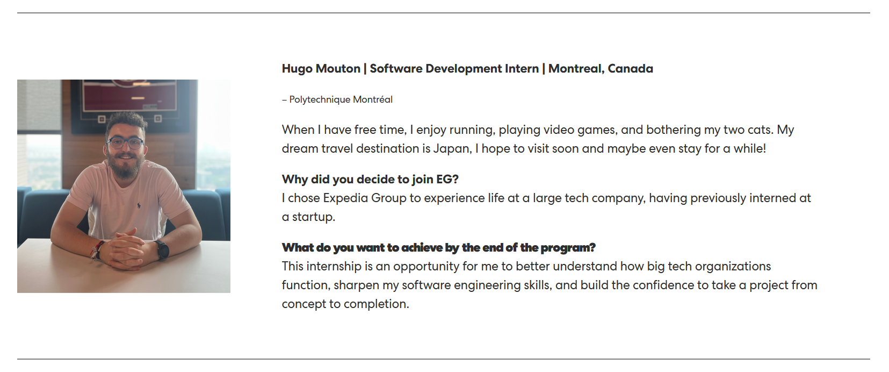

## Week 3 as a SWE Intern at Expedia

### Monday-Tuesday 02/06-03/06

The week kicked off with a deep dive into Langfuse documentation and our project codebase. After a productive meeting with my navigator, we identified potential challenges in integrating Langfuse due to our current Spring Boot version. This opened up discussions about possibly upgrading to Spring Boot 3 or finding alternative integration methods.

I also focused on refactoring our code to dynamically select parsing and formatting methods based on file extensions. While my initial implementation worked in integration tests, I realized the need for further refinement to improve code cleanliness and efficiency.

### Wednesday-Thursday 04/06-05/06 

Midweek brought its share of challenges as I worked on setting up the Spring AI quickstart. I encountered several hurdles, from the proxy access issues to credential confusion. It was a lesson in persistence and problem-solving. By Wednesday afternoon, with help from my navigator and others employees, I finally got the GenAI proxy responding to my requests. This breakthrough felt particularly rewarding after the hurdles I'd faced.

When I hit a roadblock with Langfuse integration on Thursday, I pivoted to studying System Design principles, focusing on caching and load balancing. This detour provided valuable insights that I'm sure will prove useful in future projects.

### Friday 30/05

Friday brought a shift in direction. After a conversation with my navigator, I’m refocusing on our main project. I also spoke with another team member who had previously worked on Langfuse and found a way to integrate it while bypassing Spring AI. I’ll be studying his implementation closely, as it should offer a fresh perspective on possible integration approaches.

### End of the week

Week 3 has been a rollercoaster of technical challenges and learning opportunities. Key takeaways include:
1. The importance of flexibility in problem-solving approaches
2. The value of team communication in overcoming obstacles
3. The benefits of expanding knowledge in related areas (like System Design) when faced with roadblocks

On a personal note, I've also started drafting my intern profile for the [Expedia blog](https://careers.expediagroup.com/blog/interns-of-expedia-group-2025-part-2/). It's been a great opportunity to reflect on why I chose Expedia and what I hope to achieve during my internship.

